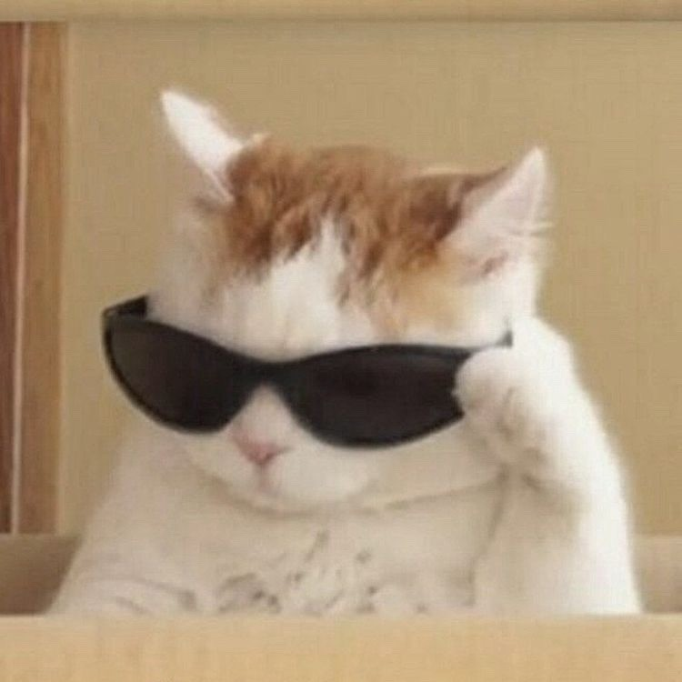

# Welcome to Steven's user page! ｡･:\*:･ﾟ★,｡･:\*:･ﾟ☆
## So glad you could make it. Let me introduce myself:

### *Who am I?*
My name is Steven Chin. I'm a fourth-year student studying math and computer science at UCSD (c/o 2023). My main interest lies in front-end development, and I'm also interested in UI/graphic design and accessibility. In my free time, I enjoy listening to K-pop ([click for my favorite song](https://www.youtube.com/watch?v=U7mPqycQ0tQ)) and playing TFT. My favorite programming language is ~~HTML~~ all of them because I love all of them equally ~~except I love HTML more~~. Here's my favorite thing I've coded:
```
    /\_____/\
   /  o   o  \
  ( ==  ^  == )
   )         (
  (           )
 ( (  )   (  ) )
(__(__)___(__)__)
* I actually didn't make this
```

### *What courses have I taken at UCSD?*
- **Python** (CSE 8A)
- **Java** (CSE 8B)
- **C++** (CSE 100)
- **Data Structures** (CSE 12/100)
- **Software Tools** (CSE 15L)
- **Mathematical Software** (MATH 157)
- **Linear Algebra** (MATH 18)
- **Graph Theory** (MATH 154)

### *What classes am I taking this quarter?*
- **Software Engineering** (CSE 110)
- **Systems Programming** (CSE 30)
- **Numerical Linear Algebra** (MATH 170A)
- **Statistics** (MATH 183)

### *What's on my to-do list?*
- [x] Wake up
- [x] Go to class
- [ ] Code
- [ ] Eat a croissant
- [ ] Sleep

### *What do people have to say about me?*
1. > He seems pretty cool. - Anonymous
2. > I don't know who he is. - Anonymous
3. > I was paid to say this. - Anonymous

### *What do I look like?*


### *What do I actually look like?*
[Click on this relative link to open a picture of me in another page!](./media/pop-cat.gif)

### *Who am I again?*
[Click on this section link for a refresher!](#who-am-i)

## Thanks for visiting! Bye for now, hope to chat soon! ヾ(＠^∇^＠)ノ

